# NeuroMech

**NeuroMech studies how experimentally supported computations in real nervous systems can inform artificial systems.** The project focuses on computational operations—what information is used, how internal state is updated, and under what conditions—not on copying a connectome or treating biological and artificial units as identical.

Biological findings, computational abstractions, and artificial-system results are tracked separately. A model result does not count as new biological validation.

The current evidence and novelty assessment is recorded in the [NMI claim and novelty audit](summery/NMI_CLAIM_AND_NOVELTY_AUDIT_20261001.md). It identifies the next useful work as mechanism-aligned computation and stronger comparisons, rather than another broad candidate or dataset search.

## Converged NMI experiment program

The project is narrowing to **two biological-computation cases tested against one shared artificial benchmark**, rather than adding more independent candidate mechanisms. The central hypothesis is that a computation grounded in a real nervous system can provide a useful inductive bias under the conditions that make its defining information relevant; the effect must survive mechanism-targeted and capacity-matched controls. This is a hypothesis to test, not an established result.

1. **M1 — higher-order visual-motion correction.** Test the source-defined correction against a capacity-matched generic correction and a phase-mismatched control. The current RR19 run is partial and mixed: H1/H3 were in the predicted direction, H2 reversed, and H4 is not established. It does not yet support a mechanism-specific positive claim.
2. **M2 — feedback-site specificity.** Test whether motor-state feedback placed in sensory-state updating has a condition-specific effect beyond output persistence, generic recurrence, and no-feedback controls. Published C. elegans work motivates this computation, while existing artificial transfers are mixed. Any new synthetic result remains a computational test, not biological validation.
3. **Shared benchmark and controls.** Use common preregistered rules for seeds, data splits, compute/parameter reporting, uncertainty, and strong controls. Keep each experiment's native endpoint separate; the project-level claim is conjunctive and must not pool unlike task scores.

**Current status:** this program is a research plan, not a completed joint demonstration. M1 remains unresolved; M2 has not established a robust structure-specific advantage; and the shared benchmark has not passed its joint criteria. M5 and Fish1.5 remain supporting evidence lines rather than additional principal artificial mechanisms. Details and historical results are tracked in the [convergence record](summery/PROJECT_CONVERGENCE_20261001/CONVERGENCE.md) and [NMI claim and novelty audit](summery/NMI_CLAIM_AND_NOVELTY_AUDIT_20261001.md).

## M5 biological mechanism update: cerebellar interval timing

The next M5 direction is now anchored to a specific published computation rather than a generic eligibility-trace analogy. Garcia-Garcia et al. report that cerebellar granule-cell activity develops anticipatory temporal profiles during reward-interval learning, that these profiles lengthen when mice relearn a longer reward delay, and that climbing-fiber activity is time-locked to reward. Their analysis applies a canonical climbing-fiber-dependent LTD rule to granule-cell activity in the preceding approximately 150 ms to derive a modeled granule-cell-to-Purkinje-cell weight profile. This supports a narrow candidate computation—**a distributed temporal basis shaped by reward-timed local plasticity**—but the synaptic weights are modeled, not directly measured, and the paper does not establish an AI benefit. [Primary study](https://pmc.ncbi.nlm.nih.gov/articles/PMC11343686/) · [Author analysis code](https://github.com/wagnerlabnih/garcia-garcia-neuron-2024).

The public [Dryad dataset](https://datadryad.org/dataset/doi%3A10.5061%2Fdryad.bk3j9kdm6) includes the 1-second-to-2-second interval-learning release with granule-cell, climbing-fiber, and licking data. The relevant activity file, licking file, and original README have been downloaded to [`data/raw/cerebellar_interval_timing_dryad_v4/`](data/raw/cerebellar_interval_timing_dryad_v4/); all three local SHA-256 hashes match Dryad's published values. The raw MAT files are about 1.76 GB combined, so the repository publishes the acquisition manifest and hashes rather than placing large binary files in Git history. A source-filtered descriptive reanalysis recovers longer GrC active duration in the 2-s expert group than the 1-s expert group (mean session-level median 1.335 s vs 0.604 s). The transitional 2-s novice sessions are variable, so this is a source-data reproduction, not new biological confirmation or a causal result. See the [reanalysis results and limits](summery/M5_CEREBELLAR_INTERVAL_RETUNING_V1/RESULTS.md).

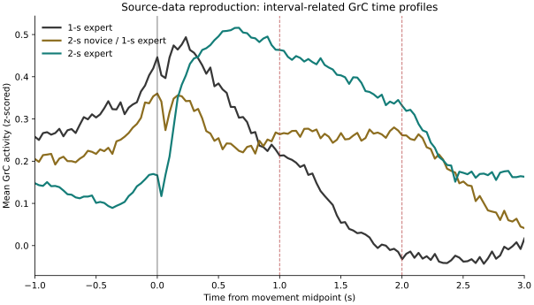

## M5 artificial transfer test: cerebellar interval timing V1

The first AI-side interval-timing test has now been run using 64 selected cell-level GrC temporal profiles derived from the published source data, with independently generated synthetic reward episodes. Across 12 paired task seeds, the biological-profile local eligibility readout had `0.836 s` mean absolute reward-time error, essentially identical to its no-trace control (`0.837 s`). It performed worse than the matched 64-unit generic RBF basis (`0.140 s`), a profile-input GRU (`0.096 s`), and a training-set empirical timer (`0.075 s`). The profile-input GRU's mean advantage over a constant-input recurrent clock was small and uncertain (`−0.022 s`, paired task-seed 95% interval `[−0.097, +0.020]`). This is a negative exploratory transfer result: the tested fixed biological basis and local update did not help this task, and the GRU comparison does not establish that the profiles add value beyond recurrent timing. The data do not establish biological causality or direct synaptic weights. See the [full contract, results, and failure analysis](summery/M5_CEREBELLAR_INTERVAL_TIMING_TRANSFER_V1/RESULTS.md), [runner and paired analysis](model/M5_CEREBELLAR_INTERVAL_TIMING_TRANSFER_V1/), and [reproducible outputs and manifests](data/results/M5_CEREBELLAR_INTERVAL_TIMING_TRANSFER_V1/).

## M5 source-data follow-up: CF-timed LTD held-out readout V1

An author-code implementation of reward-evoked climbing-fiber LTD was fit on half of each source session's eligible rewarded trials and evaluated on held-out trials. The source-derived weights had higher temporal readout `r²` than uniform weights in 15/16 sessions and than a CF-time-shuffled rule in 16/16. A fixed ridge readout was stronger in 14/16 sessions and had higher group means in all three source groups. This supports within-session predictive information in the modeled CF-timed weight ordering; it does not establish causal plasticity, measured synaptic weights, animal-level generalization, or AI transfer. This is a post-result exploratory reanalysis, and the previous negative AI-transfer result remains in force. See the [contract, results, and failure analysis](summery/M5_CEREBELLAR_CF_LTD_HELDOUT_READOUT_V1/RESULTS.md), [runner and verifier](model/M5_CEREBELLAR_CF_LTD_HELDOUT_READOUT_V1/), and [trial-level outputs and checksums](data/results/M5_CEREBELLAR_CF_LTD_HELDOUT_READOUT_V1/).

## M5 AI transfer follow-up: source-defined CF-LTD V2

The source `[−0.15,−0.025] s` CF eligibility/LTD rule was implemented directly in an 8-arm paired synthetic interval task. It did not meet the frozen transfer criterion: aligned MAE was `0.1252 s` for CF-LTD, `0.1097 s` for the no-trace update, `0.1252 s` for CF-time-shuffled teaching, and `0.1030 s` for generic RBF features; the empirical timer reached `0.0753 s`. Post-run audit found that the input profiles were fixed across episodes while target jitter was sampled independently, so the task did not encode trial-specific jitter in the neural input. This is a negative result for this implementation and a task-design boundary, not evidence against the biological mechanism. See the [frozen contract, results, and failure analysis](summery/M5_CEREBELLAR_SOURCE_LTD_TRANSFER_V2/RESULTS.md), [runner and verifier](model/M5_CEREBELLAR_SOURCE_LTD_TRANSFER_V2/), and [paired episode outputs](data/results/M5_CEREBELLAR_SOURCE_LTD_TRANSFER_V2/).

## M5 real-trial interval decoding: CF-timed LTD V1

A five-fold within-session analysis tested whether source-defined CF-timed LTD weights predict measured single-trial reward delay from GrC activity observed only before reward. Across 16 sessions (1,004 eligible trials), the CF-LTD projection's mean session-level MAE was 0.00970 s worse than the training-fold mean timer and improved it in only 1/16 sessions. A generic raw-GrC PCA16/ridge decoder improved the timer by 0.00265 s on average and in 11/16 sessions, but this descriptive advantage was absent in the transition group; raw PCA was more accurate than CF-LTD in every group. This is a negative result for the tested source-rule projection/readout, not a test of in-vivo causal plasticity or AI transfer. A zero-candidate fold rule was added after partial execution without inspecting prediction values, so the analysis is exploratory and not confirmatory. The verifier passed, and a full rerun reproduced trial predictions and fit records byte-for-byte. See the [results and limitations](summery/M5_REAL_TRIAL_INTERVAL_DECODING_V1/RESULTS.md), [contract and failure log](summery/M5_REAL_TRIAL_INTERVAL_DECODING_V1/), [runner and verifier](model/M5_REAL_TRIAL_INTERVAL_DECODING_V1/), and [canonical outputs](data/results/M5_REAL_TRIAL_INTERVAL_DECODING_V1/canonical/).

## M2 biological source-data reanalysis: AIY motor-state decoding

A retrospective, animal-level reanalysis of [Ji et al.'s](https://elifesciences.org/articles/68848) public constant-temperature traces found that AIY alone decoded forward versus reversal state with mean held-out AUC `0.758` in five WT animals and `0.502` in five RIM-ablated animals. After controlling for the immediately previous behavior state, AIY added only `0.0155` AUC in WT and approximately zero after RIM ablation. AVA showed a similar group shift, so this analysis does not establish AIY-specific residual coding. It is consistent with the published RIM-dependent motor-state representation but is not new causal or AI evidence. The independent source-to-score verifier passed. See the [contract, results, and failure log](summery/M2_AIY_STATE_CONDITIONAL_ENCODING_V1/RESULTS.md), [analysis and verifier](model/M2_AIY_STATE_CONDITIONAL_ENCODING_V1/), and [source workbooks and output manifest](data/results/M2_AIY_STATE_CONDITIONAL_ENCODING_V1/).

### M2 source-trace prospective state prediction follow-up

`M2_AIY_PREMOTOR_STATE_PREDICTION_V1` exposed a target-label problem: the strict 2-second windows had no reversal positives in the five RIM-ablated traces, so that group contrast was not estimable. The separately versioned V2 skips source-coded transition/unknown samples and predicts the next known movement state. Adding current AIY calcium to a 5-second motor-history baseline improved held-out AUC by `0.2098` in WT and `0.0779` after RIM ablation; the descriptive group contrast was `0.1318` (five animals per group). AVA's contrast was larger (`0.2229`), so the result does not establish AIY-specific predictive coding. There were only 6–18 positive samples per animal at the primary horizon; the intervals and permutation references are descriptive. An independent verifier reproduced all 60 animal × horizon × neuron model scores and checked both source-file hashes. This is an exploratory source-cohort analysis, not causal validation, animal-level generalization, or AI transfer. See the [V1 failure and V2 results](summery/M2_AIY_PREMOTOR_STATE_PREDICTION_V2/RESULTS.md), [contracts and failure records](summery/M2_AIY_PREMOTOR_STATE_PREDICTION_V1/), [analysis and independent verifier](model/M2_AIY_PREMOTOR_STATE_PREDICTION_V2/), and [canonical outputs](data/results/M2_AIY_PREMOTOR_STATE_PREDICTION_V2/).

### M2 artificial predictive-cue transfer probe V1

An exploratory synthetic switching-state task tested a low-dimensional forecast-fusion filter using a noisy short-horizon cue. The cue was generated directly from the future target; it is **not** an AIY/AVA trace, a source-derived signal, or biological validation. At aligned cue reliability (`q=0.72`, 128 training episodes), the six-parameter filter improved over its same-parameter no-cue ablation by `+0.1064` AUC (seed-bootstrap 95% interval `[+0.1024,+0.1103]`; 20/20 seed blocks positive). It did not beat the 45-parameter GRU receiving the same cue (AUC `0.8650` vs `0.7941`; contrast `−0.0709`). Under uninformative or reversed cue mappings, the filter lost less than the GRU but still performed worse than its no-cue ablation.

This demonstrates the utility of a stipulated predictive side channel and a possible robustness trade-off in one simulator, not a distinctive biological computation or broad AI benefit. The comparison is capacity-confounded; V2 adds a parameter-matched generic recurrent control. See the [V1 results and failure log](summery/M2_PREMOTOR_SIGNAL_AI_TRANSFER_V1/RESULTS.md), [runner](model/M2_PREMOTOR_SIGNAL_AI_TRANSFER_V1/), and [canonical outputs](data/results/M2_PREMOTOR_SIGNAL_AI_TRANSFER_V1/).

### M2 artificial predictive-cue transfer follow-up V2

The six-parameter filter improved over its no-cue ablation by `+0.1053` AUC (95% seed-bootstrap interval `[+0.1017,+0.1087]`), but the six-parameter generic recurrent control scored `0.8643` vs `0.7941` for the structured filter; the matched contrast was `−0.0702` (`[−0.0724,−0.0681]`; 0/20 seed blocks favored the structured filter). Under uninformative or reversed cue mappings, the structured filter lost less than the generic recurrent control, but both performed worse than their no-cue ablations. The capacity-matched comparison therefore removes V1's main comparator ambiguity without revealing a structure-specific advantage.

This is an outcome-informed follow-up in a synthetic task whose cue directly carries noisy future-target information. It establishes neither biological-to-AI transfer nor general AI benefit. The verifier recalculated seven primary contrasts and checked artifact hashes and row completeness; it did not independently retrain the models. See the [V2 results and failure log](summery/M2_PREMOTOR_SIGNAL_AI_TRANSFER_V2/RESULTS.md), [runner and verifier](model/M2_PREMOTOR_SIGNAL_AI_TRANSFER_V2/), and [canonical outputs](data/results/M2_PREMOTOR_SIGNAL_AI_TRANSFER_V2/).

## Current research focus

The project-level convergence target is **two principal mechanism cases plus one shared artificial benchmark**: M1's higher-order visual-motion correction remains a separately managed evidence line; M2 feedback-site specificity is the active mechanism-transfer focus in this workstream; and the benchmark must compare each mechanism with strong, capacity-aware controls while keeping task-native outcomes separate. M5 remains a completed exploratory case that informs the evidence base, not an additional principal claim. Fish1.5 can provide supporting same-specimen structure–function evidence, but it is not automatically a fourth artificial mechanism study. This portfolio framing is a research hypothesis and prioritization, not a result or authorization to reopen a sealed experiment.

| Line | Biological question | Current artificial evidence |
|---|---|---|
| **M1 — higher-order visual-motion correction (separate workstream)** | What does a source-defined third-order correction contribute to fly motion estimation? | The existing RR19 natural-scene run is partial and exploratory. H1/H3 were in the predicted direction, while the phase-mismatched specificity contrast H2 was in the opposite direction. H4 and an overall four-hypothesis verdict are not established. This line is tracked for context only here. See the [project convergence record](summery/PROJECT_CONVERGENCE_20261001/CONVERGENCE.md). |
| **M2 — motor-state feedback and sensory context** | Does the relation between motor-state timing and sensory/environmental context contribute to thermotaxis in the RIM–AIY model? | Public constant-temperature traces show reduced AIY-only state decoding after RIM ablation, but the incremental signal beyond prior behavior is small and AVA shows a similar group shift. AI transfer remains unresolved: the closed-loop reversal task was poorly learned; supervised state-estimation lost to output-site LTC and generic recurrence; bursty tracking did not resolve a win over GRU-8. See [AIY source-data reanalysis](summery/M2_AIY_STATE_CONDITIONAL_ENCODING_V1/RESULTS.md), [state-estimation results](summery/M2_ACTION_CONDITIONED_STATE_ESTIMATION_V1/), [LTC thermotaxis reversal](summery/M2_LTC_THERMOTAXIS_REVERSAL_V1/), [bursty-observation V1](summery/M2_BURSTY_OBSERVATION_FEEDBACK_V1/RESULTS.md), [AcRKN comparison V1](summery/M2_ACTION_CONDITIONED_RKN_2D_PURSUIT_V1/RESULTS.md), and [recipient-specific yoke V1](summery/M2_RECIPIENT_SPECIFIC_FEEDBACK_YOKE_V1/). |
| **M3 — Fish1.5 structure–function constrained integration** | Can same-specimen functional and EM evidence identify the frozen visual-motion integration computation? | Same-specimen functional-ID↔EM-ID crosswalks are documented for explicit rows, but the inspected release lacks switch-event/timebase, graded evidence, and choice/behavior fields required by the frozen mechanism. Functional class-label provenance and the pinned synapse materialization are also unresolved. Acquisition is **PARTIAL**; E3 and AI modeling remain closed. See the [mechanism evidence registry](summery/MECHANISM_EVIDENCE_REGISTRY.md). |
| **M5 — eligibility and delayed credit** | Can a local eligibility state preserve delayed teaching information under constrained recurrent-credit resources? | Eligibility has beaten immediate/no-trace updates in some synthetic XOR/bandit settings, but lost to TBPTT-4, full BPTT, exact replay, and source-derived interval-timing controls in stronger comparisons. A new decay-horizon sweep finds gains over current-score assignment that vary with reward delay, while all trace settings remain substantially below exact replay. These results bound the tested implementations and tasks; they do not establish biological synaptic causality or general AI benefit. See [source-data held-out readout](summery/M5_CEREBELLAR_CF_LTD_HELDOUT_READOUT_V1/RESULTS.md), [source-LTD transfer V2](summery/M5_CEREBELLAR_SOURCE_LTD_TRANSFER_V2/RESULTS.md), [TBPTT comparison](summery/M5_ELIGIBILITY_TRUNCATED_BPTT_V1/RESULTS.md), [memory frontiers](summery/M5_ELIGIBILITY_MEMORY_FRONTIER_V1/RESULTS.md) / [delayed reward](summery/M5_DELAYED_REWARD_MEMORY_FRONTIER_V1/RESULTS.md), and the [trace-horizon sweep](summery/M5_DELAYED_REWARD_TRACE_HORIZON_V1/RESULTS.md). |
| **Cross-mechanism benchmark (M2 + M5)** | Do mechanism-specific computations outperform strong controls under the task conditions that make those computations relevant? | Earlier V2 compared M2 with trained GRUs and M5 with overlapping delayed-credit streams. The context-aware GRU beat the small context-gain filter across mappings; M5 eligibility beat latest-input memory through delay 16 but was unresolved at delay 64, while exact FIFO was better throughout. Outcomes remain separate and exploratory; no shared positive effect is established. See the [V2 result and failure record](summery/CROSS_MECHANISM_CONTEXT_MEMORY_V2/) and [project convergence record](summery/PROJECT_CONVERGENCE_20261001/CONVERGENCE.md). |

## Convergent experiment plan

The project is organized around one testable proposition: **a biologically grounded computation may provide an artificial inductive bias when its defining signal is informative for the task, and any benefit must survive mechanism-targeted and capacity-matched comparisons.** This is a hypothesis for testing, not a result established by the experiments below.

| Study | Next experiment must establish | Current evidence and limitation | Admission to the shared claim |
|---|---|---|---|
| **M1 — higher-order visual-motion correction** | On a separately specified evaluation sample, compare the source-defined correction with a capacity-matched generic correction and a phase-mismatch control. | The existing natural-scene run is partial: H1/H3 were in the predicted direction, H2 reversed, and H4 is not established. The current result is not a successful specificity demonstration. | Count only if the fresh, frozen comparison supports the source-specific computation; preserve the existing mixed result as historical evidence. |
| **M2 — feedback-site and state-timing specificity** | Compare sensory-state feedback with output persistence, a generic adaptive controller, and a no-feedback control under informative, absent, and reversed signal-task relations; match training data and model resources. | Source-model simulations show a self-contingency effect under some gradient-reversal schedules, but the effect narrows or reverses at faster schedules. Existing abstract-task transfers are mixed and do not establish biological-to-AI transfer. | Count only within tested task conditions and if the result survives the frozen matched controls; do not generalize from a source-model result alone. |
| **Shared benchmark harness** | Apply the same preregistered seed, data-split, compute/parameter accounting, uncertainty, and control rules to both studies. Keep each study's primary outcome native to its task. | Not yet a completed experiment. M1 and M2 outcomes have different units and estimands. | A project-level claim is conjunctive: each mechanism must meet its own frozen criterion. Never pool raw task scores into a single effect. |

Fish1.5 is retained as supporting structure–function evidence, not a fourth artificial mechanism study: its inspected public release does not currently expose all fields required by the frozen computation. See the [convergence record](summery/PROJECT_CONVERGENCE_20261001/CONVERGENCE.md) for detailed blockers and historical decisions. Experiment-specific protocols, raw outcomes, and failure records remain in their linked `summery/`, `data/`, and `model/` folders.

### Latest M5 experiment: eligibility versus truncated recurrent gradients

This fresh-seed RNN study compared local eligibility with no-trace local updates, TBPTT-1, TBPTT-4, and full BPTT. Every arm used the same 24-unit RNN and 746 trainable parameters on delayed XOR. Eligibility reached `0.6974` accuracy, beating no-trace by `+0.14125` (95% task-seed interval `[+0.07188,+0.21288]`) but losing to TBPTT-4 by `−0.26588` (`[−0.32950,−0.20031]`; 1/32 seed blocks positive). Full BPTT reached `0.9996`, with its lower 95% interval at `0.99925`, confirming the task was learnable. The result bounds the local-trace benefit to weak local-update controls and does not support replacing truncated or exact recurrent gradients. Training was modestly faster than BPTT in this implementation, but accuracy was substantially lower; timing is not a hardware-independent compute measure. This is exploratory artificial evidence, not biological validation.

- [Contract, results, and failure lessons](summery/M5_ELIGIBILITY_TRUNCATED_BPTT_V1/)
- [Runner, plotter, and independent verifier](model/M5_ELIGIBILITY_TRUNCATED_BPTT_V1/)
- [Seed-level outcomes, summary, and checks](data/results/M5_ELIGIBILITY_TRUNCATED_BPTT_V1/)

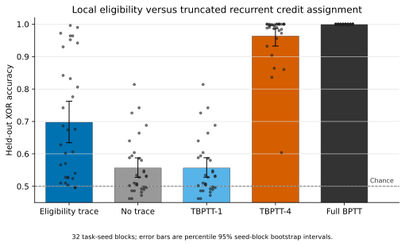

### Previous M5 experiment: delayed-reward accuracy–state frontier V1

This fresh-seed post-result bandit experiment compared the fixed 32-value eligibility trace with one- to 64-vector exact FIFO buffers and full exact replay. Averaged equally over delays 1, 4, 16, and 64, trace minus the equal-state one-vector FIFO was `−0.002484` held-out expected reward (paired task-seed 95% bootstrap interval `[−0.003243, −0.001717]`; 1/30 task-seed averages positive). Trace beat current-score assignment by `+0.009480` on average (interval `[+0.007905,+0.011087]`; 30/30 positive), but exact FIFO/replay with enough state outperformed the trace. At delay 1, exact one-vector retention won; at delays 4–64, the one-vector FIFO applied only 1/6,000 rewards, so its lower accuracy is a constrained-update failure and a weak comparison. The trace remains a fixed-state, task-specific alternative, not a superior learning rule or a biological result.

- [Frozen contract and pre-run hash record](summery/M5_DELAYED_REWARD_MEMORY_FRONTIER_V1/)
- [Results and failure lessons](summery/M5_DELAYED_REWARD_MEMORY_FRONTIER_V1/RESULTS.md) · [Figure QA](summery/M5_DELAYED_REWARD_MEMORY_FRONTIER_V1/FIGURE_QA.md)
- [Runner and independent verifier](model/M5_DELAYED_REWARD_MEMORY_FRONTIER_V1/)
- [Canonical outcomes, reproducibility, and figure bundle](data/results/M5_DELAYED_REWARD_MEMORY_FRONTIER_V1/)

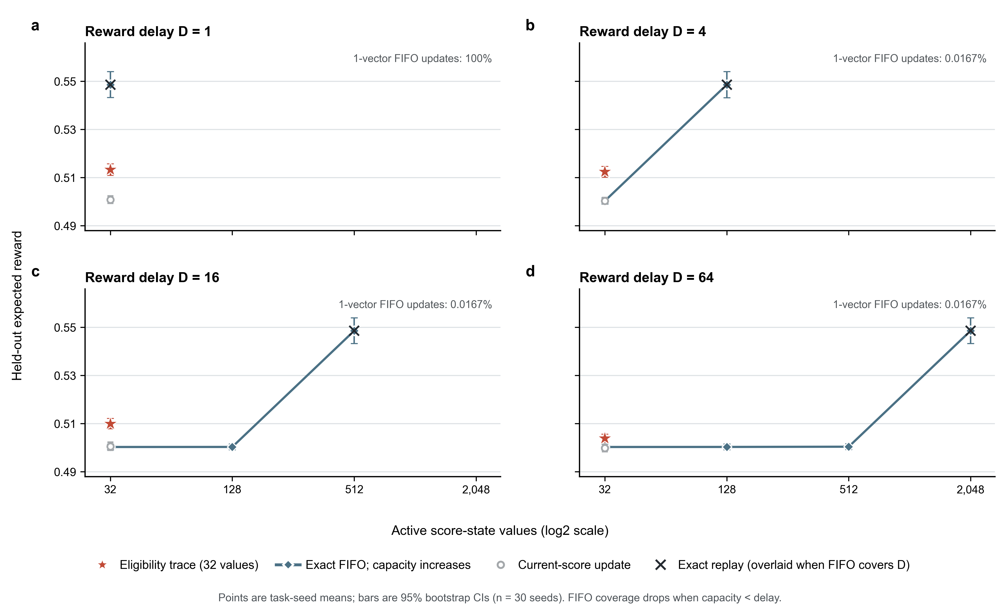

### M5 follow-up: delayed-reward trace-horizon sweep V1

Thirty new task seeds compared four fixed trace decays (`γ=0.50, 0.75, 0.90, 0.98`) at delays 1, 4, 16, and 64 in the same stationary contextual bandit. The trace-minus-current-score effect depended on delay: the largest contrasts were `+0.03160` at `D=1, γ=0.75`, `+0.01902` at `D=4, γ=0.90`, `+0.00934` at `D=16, γ=0.98`, and `+0.00345` at `D=64, γ=0.98` (all four Bonferroni familywise 95% intervals excluded zero). Exact replay averaged `0.55485` expected reward, versus `0.49932` for current-score assignment and `0.50660–0.51157` for traces; every trace was below exact replay at every delay. This is a delay-dependent compact-state trade-off in one post-result task family, not a biological transfer result, optimal gamma estimate, or general AI advantage. A verifier recomputed all contrasts and checksums, and an independent full rerun reproduced canonical result files byte-for-byte.

- [Frozen contract and result interpretation](summery/M5_DELAYED_REWARD_TRACE_HORIZON_V1/)
- [Runner and verifier](model/M5_DELAYED_REWARD_TRACE_HORIZON_V1/)
- [Canonical results, preflight, and reproducibility evidence](data/results/M5_DELAYED_REWARD_TRACE_HORIZON_V1/)

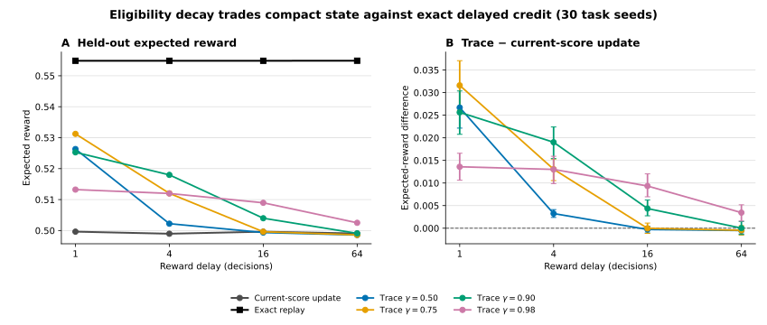

### Previous M2 baseline: bursty-observation feedback placement V1

Under a fixed expected 50% observation loss, the new artificial tracking experiment varied mean missing-run length (2, 4, and 8 steps). At the frozen long-burst condition, sensory-site feedback improved MSE over the equal-parameter output-site control by `+0.05932` (paired crossed seed/episode 95% interval `[+0.05201,+0.06673]`; 24/24 training seeds positive) and over the four-parameter generic RNN by `+0.06625` (`[+0.06000,+0.07283]`). The 8-unit GRU contrast was `+0.00756` (`[−0.00258,+0.01818]`), unresolved. Sensory-site feedback also had lower action energy but slower post-gap recovery than output persistence. Because the strong recurrent comparison is unresolved, the frozen joint mechanism-transfer criterion was not met. This is post-result exploratory evidence in an artificial task, not biological validation or broad AI evidence.

- [Frozen contract, results, and failure lessons](summery/M2_BURSTY_OBSERVATION_FEEDBACK_V1/)
- [Runner, analysis, and independent verifier](model/M2_BURSTY_OBSERVATION_FEEDBACK_V1/)
- [Canonical outcomes and verification](data/results/M2_BURSTY_OBSERVATION_FEEDBACK_V1/canonical/)

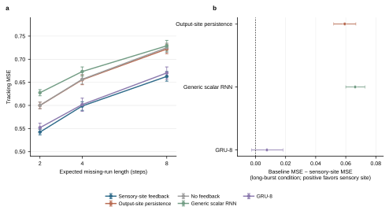

### M2 optimizer-budget follow-up: bursty observation V1

This post-result extension evaluated 32 fresh training-seed blocks at 60, 120, and 240 optimizer updates. At the long-gap condition (`q=0.125`) after 240 updates, sensory-site feedback beat the equal-parameter scalar RNN by `+0.06183` MSE (95% seed-block interval `[+0.05816,+0.06580]`, 32/32 positive), and beat the output-site and no-feedback controls by `+0.01531` and `+0.01209`. The 321-parameter GRU was unresolved against sensory-site feedback at 60 updates, then lower in MSE at 120 and 240 updates; the 240-update contrast was `−0.07726` (`[−0.08775,−0.06633]`, 0/32 positive). Sensory-site feedback also had lower action energy but higher MAE and slower recovery than output-site feedback. This sharpens the result to a narrow low-capacity placement advantage with an accuracy/energy/recovery trade-off; it rejects an overall superiority claim against a trained higher-capacity recurrent model.

- [Experiment contract, results, and failure lessons](summery/M2_BURSTY_COMPUTE_FRONTIER_V1/)
- [Runner, verifier, and figure source](model/M2_BURSTY_COMPUTE_FRONTIER_V1/)
- [Episode outcomes, summaries, and figure bundle](data/results/M2_BURSTY_COMPUTE_FRONTIER_V1/)

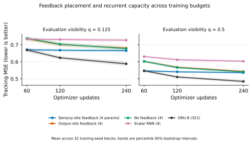

### Latest M2 experiment: action-conditioned signed-state estimation

This supervised inference study isolated signed-position estimation from end-to-end control learning. In the aligned action-to-state condition, the four-unit sensory-site LTC had MSE `1.9748`; output-site feedback was better at `1.8196` (output minus sensory `−0.15519`, 95% seed-block interval `[−0.15668, −0.15367]`), and `GRU_4` reached `0.6354`. Small sensory-site gains over no-feedback and yoked controls were only `0.00249` and `0.00229` MSE, respectively, and did not offset its losses to output-site and generic recurrence. Because a generic GRU learned the aligned task, the result is adverse to this sensory-site LTC implementation rather than an unlearnable-task artifact. Held-out coupling reversal caused marked degradation. The frozen sensory-site criterion was not met; this is exploratory artificial evidence, not biological validation.

- [Contract, results, and failure lessons](summery/M2_ACTION_CONDITIONED_STATE_ESTIMATION_V1/)
- [Runner, analysis, plotter, and verifier](model/M2_ACTION_CONDITIONED_STATE_ESTIMATION_V1/)
- [Episode outcomes, model fits, and checksums](data/results/M2_ACTION_CONDITIONED_STATE_ESTIMATION_V1/)

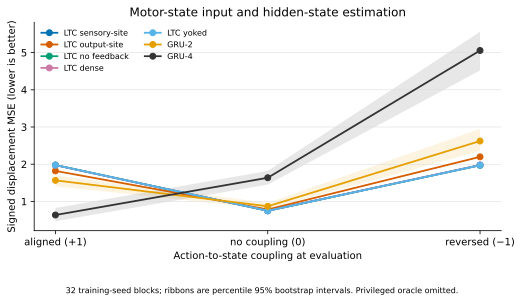

### Previous M2 experiment: LTC thermotaxis-like gradient-reversal test

This post-result exploratory artificial experiment placed motor-state feedback at sensory-state, output, dense-state, yoked, or no-feedback sites in an eight-unit liquid time-constant controller, with capacity-near-matched `GRU_4` and larger `GRU_8` references. It completed 32 training-seed blocks, three reversal hazards, and 98,304 held-out episodes. At the primary hazard (`1/20`), sensory-site feedback did not resolve from output-site, no-feedback, dense-feedback, or yoked controls. It scored lower than the two GRUs, but the learned policies as a whole barely tracked the setpoint: sensory-site position MSE was `132.32`, versus `28.82` for a privileged gradient-sign oracle. The oracle's extra information makes it diagnostic only; poor learned-controller performance prevents interpreting the GRU gap as an LTC mechanism advantage. **The frozen mechanism criterion was not met.** This is an artificial implementation/task-learning failure, not biological validation or evidence against the RIM–AIY finding.

- [Contract, results, and failure lessons](summery/M2_LTC_THERMOTAXIS_REVERSAL_V1/)
- [Runner, analysis, plotter, and verifier](model/M2_LTC_THERMOTAXIS_REVERSAL_V1/)
- [Episode-level outcomes, run metadata, and verification](data/results/M2_LTC_THERMOTAXIS_REVERSAL_V1/)

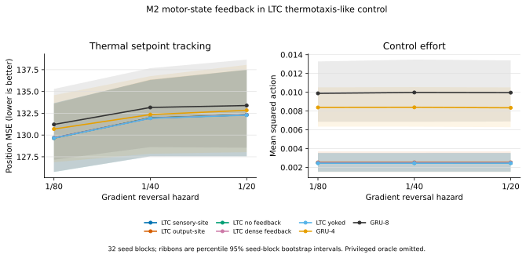

### Previous M5 experiment: eligibility-trace accuracy–memory frontier V1

This post-result exploratory study compared a fixed 64-feature eligibility state with exact FIFO replay at capacities from 64 to 4,096 feature values and with unbounded exact replay. Across three fixed input generators, 30 fresh task seeds per generator, and four delays, trace accuracy exceeded the one-vector FIFO by `+0.14779` on average (hierarchical seed-bootstrap 95% interval `[+0.13757, +0.15796]`; 90/90 generator-seed blocks positive). That headline is conditional: at delays 4–64, the one-vector FIFO retained only `1/3000` labeled cues for updates, so the result reflects an update-coverage failure of the constrained exact buffer. At delay 1, exact one-vector retention won; once FIFO capacity scaled with delay, exact replay approached the unbounded reference and outperformed the trace. The result is a task-specific resource tradeoff, not a general trace advantage, measured RAM/energy saving, biological validation, or general AI benefit.

- [Frozen contract](summery/M5_ELIGIBILITY_MEMORY_FRONTIER_V1/CONTRACT.md) · [Results](summery/M5_ELIGIBILITY_MEMORY_FRONTIER_V1/RESULTS.md) · [Failure and limitation log](summery/M5_ELIGIBILITY_MEMORY_FRONTIER_V1/FAILURE_LOG.md) · [Figure contract](summery/M5_ELIGIBILITY_MEMORY_FRONTIER_V1/FIGURE_CONTRACT.md)
- [Runner, verifier, and figure source](model/M5_ELIGIBILITY_MEMORY_FRONTIER_V1/)
- [Canonical outcomes, manifest, and figures](data/results/M5_ELIGIBILITY_MEMORY_FRONTIER_V1/)

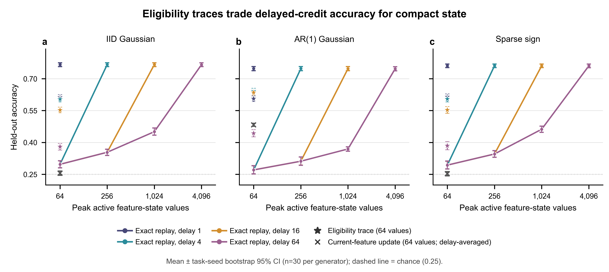

### Previous M2 experiment: action-conditioned state-space comparison on 2D pursuit V1

This post-result exploratory benchmark compared the 8-parameter M2 mode-gain estimator with the official AcRKN cell adapted to the same 2D pursuit task, an 8-parameter bilinear recurrent control, a recipient-action yoke, and a task-aware Kalman reference. In the aligned primary condition, final distance was `0.13356` for mode-gain versus `1.02141` for adapted AcRKN (`AcRKN − mode = +0.88785`, crossed 95% interval `[+0.59512,+1.23230]`; 24/24 seed-block means positive). However, the parameter-matched bilinear RNN did better than mode-gain (`bilinear − mode = −0.03035`, interval `[−0.04391,−0.01786]`; lower distance in 20/24 seed blocks) and also outperformed it under reversed sensor mapping. The task-aware oracle remained best. Thus the frozen AcRKN primary contrast does not demonstrate a distinctive M2 computation; the stronger matched control is a counterexample to that interpretation. Self-contingent feedback beat the action yoke in this simulator, but the yoke changes recipient trajectory alignment and cannot isolate a biological feedback site. The AcRKN arm is a 32-parameter, one-latent-observation adaptation, not a full reproduction of the published robotics model. No biological validation or general AI claim follows.

- [Frozen experiment contract](summery/M2_ACTION_CONDITIONED_RKN_2D_PURSUIT_V1/CONTRACT.md) · [Results](summery/M2_ACTION_CONDITIONED_RKN_2D_PURSUIT_V1/RESULTS.md) · [Failure and limitation log](summery/M2_ACTION_CONDITIONED_RKN_2D_PURSUIT_V1/FAILURE_LOG.md)
- [Runner, independent verifier, and adapted AcRKN source](model/M2_ACTION_CONDITIONED_RKN_2D_PURSUIT_V1/)
- [Episode-level outcomes, training metrics, yoke audit, and manifest](data/results/M2_ACTION_CONDITIONED_RKN_2D_PURSUIT_V1/canonical/)

### Previous M2 experiment: recipient-specific motor-feedback yoke V1

This post-result exploratory artificial transfer study tested whether a recipient's own previous motor signal helps more than a cross-agent replay with the same cohort-level signal distribution at every timestep. In the primary condition (target-switch hazard `1/120`, 50% missing observations), self-feedback reduced held-out tracking MSE relative to the yoke by `0.04143` (crossed 95% seed/episode interval `[0.03901, 0.04383]`; 32/32 seed means positive). The three-parameter sensory-site controller also beat a three-parameter generic one-state RNN, but the task-aware oracle remained better. Its advantage over output persistence and no-feedback was small, and those direct comparisons reversed in some high-missingness conditions. The yoke breaks alignment with the recipient's whole trajectory, including target and observation history, so the contrast supports recipient-specific contingency in this simulator but does not isolate the unique causal role of a biological feedback signal. It is not independent of the earlier sparse-tracking task family, is not biological validation, and does not establish a general AI benefit.

- [Experiment contract, results, and failure lessons](summery/M2_RECIPIENT_SPECIFIC_FEEDBACK_YOKE_V1/)
- [Runner, verifier, and figure source](model/M2_RECIPIENT_SPECIFIC_FEEDBACK_YOKE_V1/)
- [Canonical outcomes and independent rerun record](data/results/M2_RECIPIENT_SPECIFIC_FEEDBACK_YOKE_V1/)
- [Rendered figure and QA manifest](data/results/M2_RECIPIENT_SPECIFIC_FEEDBACK_YOKE_V1/figures/)

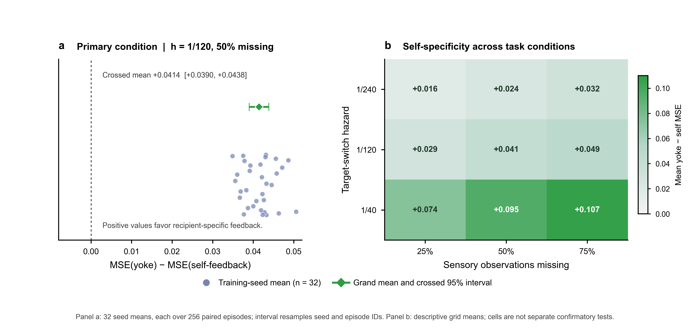

### Previous latest cross-mechanism experiment: context and delayed credit V2

V2 extended the earlier exploratory benchmark with trained recurrent estimators for M2 and an overlapping-input delayed-teaching task for M5. In M2, an 8-unit context-aware GRU (297 parameters) had lower latent-state MSE than the 3-parameter context-gain filter in aligned, independent, and reversed mappings; the aligned mean contrast `GRU − filter` was `−0.02473` (95% seed-bootstrap interval `[−0.02640, −0.02293]`). The observation-only GRU (273 parameters) was approximately tied with the filter when aligned (`−0.00008`, interval `[−0.00279, +0.00265]`) and better in the other mappings. This does not support a unique context-gain advantage against the stronger learned estimators, and parameter counts are not matched.

In M5, the 16-dimensional eligibility trace exceeded an equal-state latest-input memory at delays 1, 4, and 16 (`+0.42798`, `+0.39426`, and `+0.29788` accuracy; each 95% interval excluded zero), but the contrast was unresolved at delay 64 (`+0.02817`, interval `[−0.00205, +0.05936]`). An exact FIFO reference outperformed eligibility at every delay; FIFO memory grows with delay and is not state matched. Thus the trace offers bounded artificial credit-assignment benefit over a weak latest-input control at short/medium delays, not a general advantage over explicit memory. M2 MSE and M5 accuracy remain separate; the study is post-result exploratory and establishes neither biological validation nor general AI benefit. The first run's parameter/state-accounting issue was retained as noncanonical. Corrected outputs passed an independent verifier and byte-identical full rerun; figure source, data, and rendered QA are linked below.

- [Contract, results, and implementation-correction record](summery/CROSS_MECHANISM_CONTEXT_MEMORY_V2/)
- [Detailed results and failure analysis](summery/CROSS_MECHANISM_CONTEXT_MEMORY_V2/RESULTS.md)
- [Figure contract](summery/CROSS_MECHANISM_CONTEXT_MEMORY_V2/FIGURE_CONTRACT.md)
- [Runner and verifier](model/CROSS_MECHANISM_CONTEXT_MEMORY_V2/)
- [Corrected outcomes and independent rerun hashes](data/results/CROSS_MECHANISM_CONTEXT_MEMORY_V2/)
- [Figure source and audit bundle](data/results/CROSS_MECHANISM_CONTEXT_MEMORY_V2/figures/)

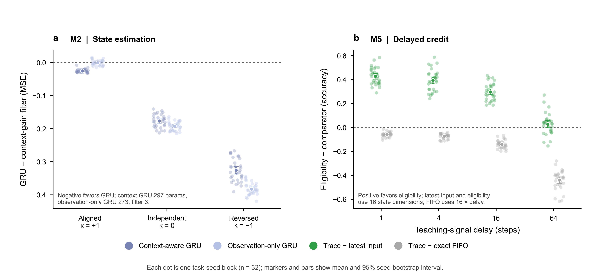

### Previous cross-mechanism experiment: context and delayed credit V1

The shared-workflow benchmark compared M2 context-conditioned sensory gain with a three-parameter additive recurrent filter and M5 eligibility-trace learning with delayed labels. M2's aligned-context MSE advantage was `+0.05871` (95% task-seed interval `[+0.05770,+0.05973]`), but the contrast reversed when context was independent (`−0.13000`) or anti-aligned (`−0.31992`). M5 eligibility beat an unrelated-feature misassignment control, yet matched an equal-state persistent-cue buffer exactly at all four delays. The result therefore shows an M2 task-alignment boundary and no distinct trace advantage over direct cue retention; it does not establish a shared positive principle, biological validation, or general AI benefit. Both modules are post-result exploratory and retain separate outcome units. The corrected run was independently repeated with byte-identical seed-level CSVs and summary.

- [Contract, results, and failure record](summery/CROSS_MECHANISM_CONTEXT_MEMORY_V1/)
- [Runner and verifier](model/CROSS_MECHANISM_CONTEXT_MEMORY_V1/)
- [Canonical outcomes and reproducibility record](data/results/CROSS_MECHANISM_CONTEXT_MEMORY_V1/)

### M2 artificial transfer result: sparse-sensation tracking

In a closed-loop target-tracking simulation, the three-parameter sensory-state feedback policy achieved mean squared tracking error `0.2581` at the training condition (target-switch hazard `1/120`, 50% missing sensory samples), compared with `0.3020` for a three-parameter one-state generic RNN. The paired difference `MSE(generic) − MSE(sensory feedback)` was `+0.04386` (crossed 95% bootstrap interval `[+0.04247,+0.04526]`; 32/32 training-seed clusters positive). It also exceeded equal-parameter output-site persistence and no-feedback controls by `+0.00403` and `+0.00416`. The task-aware oracle remained better (`0.2283`). The advantage reversed under slower target switching with 75% missing observations, where output persistence and no feedback had lower error. An independent run reproduced all 368,640 episode rows byte-for-byte. This is an artificial task-specific result; missing observations were exact-zero encoded, the generic model had only one hidden state, and no biological-to-AI or general-AI claim follows. See the [protocol, results and limitations](summery/M2_MOTOR_FEEDBACK_SPARSE_TRACKING_V1/), [model and verifier](model/M2_MOTOR_FEEDBACK_SPARSE_TRACKING_V1/), and [raw outcomes and figure bundle](data/results/M2_MOTOR_FEEDBACK_SPARSE_TRACKING_V1/).

### M2 source-model feedback-site control

A retrospective Figure 7 source-model follow-up replayed complete ordered movement-state and latent motor-state sequences from independent development trajectories, using the source model's two-step heading-transition timing. Sensory-site feedback exceeded this full-trajectory yoke by `+0.4516` warm-direction index (95% paired seed-block interval `[+0.4443, +0.4589]`; 200/200 held-out blocks positive). The reported marginal persistence summaries were close, but no equivalence margins were frozen. This indicates that replaying an independent motor trajectory was insufficient in this source-model implementation; it does not establish a unique biological synapse, biological validation, or AI transfer. See the [contract, results, and failure record](summery/M2_STATE_TRAJECTORY_YOKED_DIRECTION_V2/), [runner](model/M2_STATE_TRAJECTORY_YOKED_DIRECTION_V2/), and [archived outputs](data/results/M2_STATE_TRAJECTORY_YOKED_DIRECTION_V2/).

### M2 context-information operating boundary

A new 30-seed artificial dose-response study trained the state-conditioned gain filter under full context/sensor alignment, then tested 11 progressively weakened or reversed mappings using paired latent paths and noise. The mode-gain update was worse than the context-free filter through `κ=+0.20`, unresolved at `+0.30`, and better at `+0.40` and `+0.50`; the estimated crossover was `κ=0.285` (crossed-bootstrap 95% interval `[0.251, 0.318]`). At full alignment, it also beat the learned generic recurrent controls, while a task-aware Kalman reference remained better. This quantifies a sharp task-specific operating boundary; it does not establish the same numerical relation in the worm or broad AI benefit. See the [contract, results, and failure log](summery/M2_CONTEXT_INFORMATION_DOSE_V1/), [runner and verifier](model/M2_CONTEXT_INFORMATION_DOSE_V1/), and [raw outputs](data/results/M2_CONTEXT_INFORMATION_DOSE_V1/).

### M2 2D closed-loop pursuit V1 boundary

A new sensorimotor task paired the M2-inspired state-gated estimator against 8-parameter additive and bilinear recurrent controls. In the aligned 2D pursuit environment, the mode-gain system reached 84.2% success; the parameter-matched bilinear baseline reached 90.5% and had lower final distance by `0.0209` (crossed-bootstrap 95% interval for bilinear minus mode `[-0.0324,-0.0105]`). The no-context ablation was similar to mode-gain, while reversing the mapping reduced mode-gain success to 30.2%. Although mode-gain had lower supervised training loss, that advantage did not carry into closed-loop control. This adverse result raised a training/deployment distribution mismatch as one candidate explanation; it did not isolate the cause. The mapping is artificial and does not test biological equivalence. See the [contract, results, and failure log](summery/M2_2D_CLOSED_LOOP_PURSUIT_V1/), [runner and verifier](model/M2_2D_CLOSED_LOOP_PURSUIT_V1/), and [episode outcomes](data/results/M2_2D_CLOSED_LOOP_PURSUIT_V1/).

### M2 2D closed-loop pursuit V2: training-distribution diagnostic

A post-result paired diagnostic trained all learned models on either random-action trajectories or shared trajectories generated by a task-aware Kalman teacher with 25% random exploration. The aligned bilinear-minus-mode final-distance contrast shifted from `−0.01885` (95% crossed interval `[−0.02791,−0.01059]`) under random-action training to `+0.00394` (`[+0.00051,+0.00750]`) under teacher-mixed training; the regime interaction was `+0.02279` (`[+0.01341,+0.03318]`). This supports training distribution as a material contributor to the V1 ranking in this task, not as its unique cause. MODE_GAIN still did not beat every control: the additive model had the best aligned final distance, and the no-context ablation remained comparable. The reversed mapping remained harmful. The study is exploratory and makes no biological-transfer or general-AI claim. See the [contract, results, and limitations](summery/M2_2D_CLOSED_LOOP_PURSUIT_V2_TRAIN_DIST_DIAGNOSTIC/), [runner and verifier](model/M2_2D_CLOSED_LOOP_PURSUIT_V2_TRAIN_DIST_DIAGNOSTIC/), and [canonical outputs](data/results/M2_2D_CLOSED_LOOP_PURSUIT_V2_TRAIN_DIST_DIAGNOSTIC/).

### M2 corollary-discharge placement: sensory state vs output persistence

A mechanism-aligned synthetic test compared the same previous-action signal entering either the sensory-state update or the output decision, with a parameter-matched no-feedback model, generic two-unit RNN and Bayes reference. At the trained state-switch hazard (`0.05`), sensory-site feedback exceeded output persistence by `+6.80` percentage points in accuracy (crossed 95% interval `[+6.48,+7.12]`). However, it did not beat no feedback (88.94% vs 89.05%), the generic RNN (90.21%) or Bayes (90.30%). The sensory-site model recovered from state changes faster than output persistence, suggesting a feedback-placement effect on stability versus switching rather than a general performance gain. The task is synthetic and does not validate the worm mechanism. See the [contract, results and failure log](summery/M2_COROLLARY_DISCHARGE_PLACEMENT_TRANSFER_V1/), [runner and verifier](model/M2_COROLLARY_DISCHARGE_PLACEMENT_TRANSFER_V1/), and [canonical outputs](data/results/M2_COROLLARY_DISCHARGE_PLACEMENT_TRANSFER_V1/).

### M2 source-model stress test: changing thermal-gradient direction

The corrected Ji et al. Figure 7 model was evaluated with a spatial warm-gradient direction that either stayed fixed or reversed every 40, 20, 10 or 5 seconds. At the 20-second schedule, the source model's sensory-site feedback arm exceeded its no-feedback ablation by `+0.07379` local-progress units per second (95% seed-block interval `[+0.07061,+0.07694]`; 100/100 simulated blocks positive). Progress declined as reversals became more frequent. The nominal output-site comparator saturated at 100% forward-state occupancy and 200-second runs, so its primary contrast cannot isolate feedback placement. This is an exploratory simulation-derived boundary, not animal-level evidence or AI benefit. See the [contract, results and failure log](summery/M2_SOURCE_MODEL_GRADIENT_REVERSAL_V1/), [runner and verifier](model/M2_SOURCE_MODEL_GRADIENT_REVERSAL_V1/), and [canonical results](data/results/M2_SOURCE_MODEL_GRADIENT_REVERSAL_V1/).

### M2 source-model self-contingency test: cross-agent yoked feedback

A follow-up kept the source-model feedback signal's instantaneous distribution across agents exactly fixed while permuting each agent's signal to another agent. At the primary 20-second gradient reversal, self-contingent feedback exceeded the cross-agent yoke by `+0.04618` aligned-progress units per second (95% seed-block bootstrap interval `[+0.04252,+0.04994]`; 100/100 simulation blocks positive). The advantage narrowed as reversals accelerated and slightly reversed at 5 seconds (`−0.00139`, interval `[−0.00261,−0.00019]`). This separates recipient-specific contingency from a generic population-level positive signal within this model, but does not establish biological causality or artificial-system benefit. The yoke replays signals from paired self-feedback trajectories, so the result remains a retrospective source-model probe. See the [contract, results and limitations](summery/M2_SELF_VS_YOKED_SENSORY_FEEDBACK_V1/), [runner and verifier](model/M2_SELF_VS_YOKED_SENSORY_FEEDBACK_V1/), and [raw results and figure](data/results/M2_SELF_VS_YOKED_SENSORY_FEEDBACK_V1/canonical/).

### Converged experimental package

The active workstream's candidate package is **M2 + M5 + one shared artificial benchmark**. M2 tests feedback-site and state-timing specificity in the RIM–AIY thermotaxis circuit; M5 tests a bounded eligibility/credit-assignment abstraction motivated by cerebellar teaching events. RR19/M1 is developed separately. Any shared benchmark must keep task-specific outcomes separate and compare each computation with its own strong controls; current results do not establish the project-level transfer claim.

### Fish1.5 structure–function evidence and current boundary

Fish1.5 remains a supporting biological evidence line, not a fourth full artificial-mechanism study. The official release provides same-specimen imaging/EM registration and an explicit functional-ID-to-EM-ID crosswalk for listed neurons. That registration alone does not identify the frozen iMI/cMI/MON→SMI direction-switch/evidence-update computation: the inspected functional release does not expose switch-event timing, a graded evidence sequence, or choice/behavior linkage. Functional class-label provenance is unresolved, and the archived synapse materialization is not version-pinned. The current status is therefore **acquisition PARTIAL, E3 CLOSED, no Fish1.5 AI model**. These are limits of the inspected public substrate, not evidence against the biological mechanism. See the [mechanism evidence registry](summery/MECHANISM_EVIDENCE_REGISTRY.md) for the frozen scope and claim boundaries.

The active workstream's candidate package remains **M2 + M5 + one shared artificial benchmark**; the M1/RR19 line is managed separately. The studies use different biological systems and task-specific outcomes; a common benchmark must preserve those separate estimands and compare each mechanism with its own strong controls. Current exploratory outcomes do not establish the paper-level transfer claim.

The M2 state-gated sensory-update and active-sensing studies are supporting algorithmic probes, not substitutes for the feedback-site-specificity study or direct biological validation. Their benefits are conditional on the task's state/observation mapping, and stronger generic or task-aware references remain competitive. See [M2 transfer evidence](summery/M2_FORWARD_STATE_SENSORY_GATE_V3/RESULTS.md) and [closed-loop active-sensing results](summery/M2_CLOSED_LOOP_ACTIVE_SENSING_V1/RESULTS.md).

## Earlier artificial benchmark: M2 low-data conditional update V1

Twenty paired task seeds compared a four-parameter state-conditioned gain filter with a four-parameter additive scalar RNN at four training-set sizes (16, 64, 256, 1024), using the same 250 optimizer updates and 640,000 sequence-step tokens per fit. In the ALIGNED synthetic mapping, `MSE(GENERIC_RNN_1D) − MSE(MODE_GAIN_FILTER)` averaged `+0.01149` (seed-bootstrap 95% interval `[+0.01083, +0.01219]`; 20/20 seeds positive). The effect was nearly constant across data sizes. In INDEPENDENT and REVERSED mappings, the additive RNN was better at every size; the reversed mapping produced the largest penalty for the structured update.

This tests a narrow artificial inductive-bias claim. The context-to-observation mapping is not a demonstrated biological detail, the generic control cannot express a multiplicative input-by-context interaction, and prior stronger adaptive references remain relevant. It does not establish biological validation or broad AI benefit. The independent verifier checked all 122,880 held-out episode rows and the paired-seed result.

- [Contract, results and failure record](summery/M2_LOW_DATA_GATING_V1/)
- [Runner and independent verifier](model/M2_LOW_DATA_GATING_V1/)
- [Episode-level outcomes and manifest](data/results/M2_LOW_DATA_GATING_V1/)

## Follow-up: M2 low-data benchmark V2 with bilinear control

V2 replaced the additive comparator with a four-parameter bilinear tanh recurrent model that includes an explicit input×context term. On disjoint seeds, the mode-gain filter still had lower MSE in the ALIGNED primary (`bilinear − mode = +0.00509`, 95% seed-bootstrap interval `[+0.00465, +0.00552]`, 20/20 positive). It also scored lower than the bilinear model in INDEPENDENT and REVERSED mappings, while its own absolute MSE rose from about `0.056` aligned to `0.097` reversed. Because the relative advantage persists when the context mapping is wrong, this result does not isolate an alignment-specific biological computation. Comparator equation and nonlinear dynamics remain confounded; stronger filtering and task-aware references remain necessary.

- [Contract, results and failure analysis](summery/M2_LOW_DATA_GATING_V2/)
- [Runner and independent verifier](model/M2_LOW_DATA_GATING_V2/)
- [Episode-level outcomes and manifest](data/results/M2_LOW_DATA_GATING_V2/)

## Follow-up: M2 conditional-update benchmark V3

V3 added a no-context constant-gain filter, a five-parameter free linear bilinear update, and a Kalman oracle using each test sequence's known dynamics. Across four data sizes, the state-conditioned filter beat the constant-gain ablation by `0.00899` MSE in ALIGNED evaluation (95% seed-bootstrap interval `[0.00847, 0.00946]`, 20/20 positive) and beat the bilinear update by `0.00656` (`[0.00614, 0.00695]`). Under mapping shifts, the context-free filter was better: mean MSE `0.0532` vs `0.0675` in INDEPENDENT and `0.0662` vs `0.0981` in REVERSED. The Kalman oracle remained best in all three conditions.

This supports a task-bounded synthetic result: context-dependent gain helps when context marks the informative channel and harms when that relation changes. The mapping was imposed in the artificial task and is not established as the worm's measured computation. It therefore does not close the biological-to-AI transfer claim.

- [Contract, results and failure analysis](summery/M2_LOW_DATA_GATING_V3/)
- [Runner and independent verifier](model/M2_LOW_DATA_GATING_V3/)
- [Episode outcomes and manifest](data/results/M2_LOW_DATA_GATING_V3/)

## New task-family test: M2 sequential binary decision V1

The state-conditioned update was transferred from continuous latent-state estimation to terminal left/right decisions after 32 steps of noisy evidence accumulation. In the ALIGNED synthetic condition, accuracy averaged `0.7029` across four training-set sizes, versus `0.6385` for constant gain; the paired difference was `+0.06448` (95% seed-bootstrap interval `[+0.05703, +0.07232]`, 20/20 positive). The context-free model was better in INDEPENDENT (`0.6413` vs `0.6145`) and REVERSED (`0.6368` vs `0.5192`). The Bayesian oracle achieved `0.760–0.838` across conditions.

This is evidence that the artificial operation generalizes across two task objectives under the imposed aligned context relation, with substantial mismatch cost and a gap to the oracle. The context/evidence relation is synthetic and has not been established as a biological property of the worm circuit. The result does not establish biological-to-AI transfer or broad AI benefit.

- [Contract, results and failure analysis](summery/M2_SEQUENTIAL_DECISION_V1/)
- [Runner and independent verifier](model/M2_SEQUENTIAL_DECISION_V1/)
- [Episode outcomes and manifest](data/results/M2_SEQUENTIAL_DECISION_V1/)

### M2 context-dose transfer to terminal decisions

A 30-seed extension measured the same 11 context-information doses on a terminal left/right decision objective. The mode-gain filter's advantage over constant gain crossed zero near `κ=0.134` (crossed-bootstrap 95% interval `[0.072, 0.200]`): it was below the constant filter at `κ=0`, unresolved at `+0.10`, and better from `+0.20` upward. The crossover differs descriptively from the continuous-estimation result (`κ≈0.285`), showing that the operating boundary changes with the task objective. At full alignment, mode-gain accuracy was `0.7111`, versus `0.6460` for constant gain, while the Bayes reference remained ahead by `13.3` percentage points. This is objective transfer within a closely related synthetic evidence model, not broad task-family or biological transfer. See the [contract, results, and failure log](summery/M2_DECISION_CONTEXT_DOSE_V1/), [runner and verifier](model/M2_DECISION_CONTEXT_DOSE_V1/), and [trial-level data](data/results/M2_DECISION_CONTEXT_DOSE_V1/).

## Active integrated study: O3 AIY state-pattern rescue

The next mainline study is a prospective *C. elegans* thermotaxis experiment asking whether restoring the forward-state timing of AIY activity under RIM perturbation rescues thermosensory gating and forward-run persistence. Its decisive control is the same AIY stimulation waveform delivered at yoked times, matched for total light exposure. Broad motor-state sensory gating and AIY optogenetic control are already established; the candidate contribution is the specific timing-dependent rescue in the RIM–AIY thermotaxis circuit, not the general phenomenon. The focused literature audit and executable design outline are in [O3 route plan](experiments/biological_validation/O3_AIY_STATE_RESCUE_NOVELTY_AND_EXECUTION_PLAN.md).

The current M2 AI-side experiment remains an exploratory synthetic boundary test. Its sensor-reliability mapping is not established by the worm study and will not serve as the central biological transfer claim. An artificial state-gated update benchmark can continue in parallel with experimental preparation, but its result remains conditional until the biological computation is directly tested.

## Previous source-model experiment: M2 full motor-state trajectory replay V1

Complete forward/reverse mode sequences from independent corrected-model development runs were replayed on held-out heading streams, preserving each 200-second mode trace while breaking its relationship to the held-out position and heading. The equal-weighted sensory-site minus replay warm-direction contrast was `+0.44742` (95% seed-block bootstrap interval `[+0.43988, +0.45497]`; 200/200 blocks positive).

Held-out forward-state summaries were close across noise scales; reverse-duration summaries were close at `1.00` and `1.25`, with a residual reverse-tail difference at `0.75`. No equivalence bounds were frozen. The exploratory source-model result suggests independent motor-state timing alone does not recover warm-direction behavior in this task, but it does not isolate a unique biological feedback site, animal-level effect, or AI benefit. MATLAB/Octave execution parity remains unverified.

- [Contract, results, and limitation log](summery/M2_STATE_TRAJECTORY_REPLAY_V1/)
- [Replay runner, corrected source model, and verifier](model/M2_STATE_TRAJECTORY_REPLAY_V1/)
- [Packed development traces, held-out data, and verification](data/results/M2_STATE_TRAJECTORY_REPLAY_V1/)

## Previous experiment: M2 marginal-persistence yoke V1

The corrected Figure 7 sensory-feedback model was compared with a motor-state yoke that resampled forward and reverse bout durations from independent development simulations without access to current position, heading, or temperature. The pooled sensory-site minus yoke warm-direction contrast was `+0.45489` (95% seed-block bootstrap interval `[+0.44770, +0.46211]`; 200/200 blocks positive); the yoke's direction index was near zero.

The yoke did not reproduce persistence adequately at noise scale `0.75` (mean forward-bout difference `+0.609 s`, P90 `+2.623 s`, and long-run fraction `+0.00878`). There were no frozen equivalence bounds, so close duration summaries at noise scales `1.00` and `1.25` are descriptive only. This exploratory result does not establish a matched-control feedback-site effect. The next control should replay complete development motor-state trajectories and pass a held-out persistence-adequacy check before interpreting direction outcomes.

- [Contract, results, and failure log](summery/M2_PERSISTENCE_YOKED_DIRECTION_V1/)
- [Yoke runner, source model, and independent verifier](model/M2_PERSISTENCE_YOKED_DIRECTION_V1/)
- [Development libraries and held-out outputs](data/results/M2_PERSISTENCE_YOKED_DIRECTION_V1/)

## Previous experiment: M2 feedback-site specificity V5

V5 corrected a one-sample offset in the Figure 7 sensory-delay index: the author MATLAB lookup `max(1, ti−delay)` maps to Python `max(0, t−delay)`. The equal-weighted sensory-site minus motor-only warm-direction contrast remained positive at `+0.13936` (95% seed-block bootstrap interval `[+0.13572, +0.14295]`; 200/200 blocks positive).

The motor-only control still failed to match persistence: it had shorter mean and P90 run durations, longer median durations, and fewer long runs at each tested noise scale. This outcome-informed source-model comparison therefore does not isolate feedback-site specificity. The index was checked against MATLAB source code, but MATLAB/Octave execution parity, random-number behavior and smoothing boundaries remain unverified. It is not biological validation or AI-transfer evidence.

- [Contract, results, and failure log](summery/M2_FEEDBACK_SITE_SPECIFICITY_V5/)
- [Corrected runner, source model, and independent verifier](model/M2_FEEDBACK_SITE_SPECIFICITY_V5/)
- [Development and held-out outputs](data/results/M2_FEEDBACK_SITE_SPECIFICITY_V5/)

## Previous synthetic experiment: M5 eligibility trace on learnable delayed XOR V2

The earlier M10 XOR run was inconclusive because even BPTT stayed near chance. After an outcome-informed optimizer calibration, V2 used a fixed Adam optimizer and fresh task seeds on the learnable four-step delay. Held-out accuracy was `0.7347` for the local eligibility trace, `0.5529` for the no-trace local update, and `0.9997` for BPTT. The paired trace-minus-no-trace difference was `+0.1819` (95% task-seed bootstrap interval `[+0.1141, +0.2485]`; 24/30 seeds positive). BPTT passed the task-viability check but remained much stronger than the trace.

This is a post-result synthetic optimization study. It supports a narrow short-delay improvement over the immediate local-update ablation; it does not show parity with BPTT, long-delay transfer, biological validation, or general AI benefit. Compute cost was not matched.

- [Contract, results and failure log](summery/M5_ELIGIBILITY_TEMPORAL_XOR_V2/)
- [Runner and independent verifier](model/M5_ELIGIBILITY_TEMPORAL_XOR_V2/)
- [Episode outcomes and manifest](data/results/M5_ELIGIBILITY_TEMPORAL_XOR_V2/)

## M8 secondary analysis: equal-budget replay versus truncated history

A post-result analysis of the M8 delayed-credit benchmark compared exact replay with a truncated horizon storing the same nominal number of recent feature values (`D × 64`). Exact replay exceeded the matched horizon by `0.3082` absolute held-out accuracy (30.82 percentage points; paired task-seed bootstrap 95% interval `[0.3019, 0.3142]`; 30/30 task seeds favored replay). The advantage increased with delay, from `0.2079` at D=4 to `0.4271` at D=64.

This is a boundary result for one synthetic random-feature task: the truncated-horizon arm did not use its nominal feature-history budget more effectively than exact replay. It does not directly test the eligibility-trace update rule used in M5, and it does not establish replay as universally better. The budget counts active learner feature-history values, not measured process memory; shared task arrays and delayed-prediction history are excluded. This analysis was selected after the M8 outcomes were known, reuses the same 30 task seeds, and is descriptive rather than an independent or confirmatory experiment. Biological evidence supports a timed climbing-fiber teaching event in delay eyeblink learning, while the eligibility-trace equation remains a computational hypothesis; see the [M5 biological evidence and claim boundary](summery/M5_CEREBELLAR/RESULTS.md). These artificial results provide no biological validation.

- [Analysis contract, result and limitations](summery/M8_MEMORY_MATCHED_REPLAY_ANALYSIS/)
- [Analysis script](model/M8_MEMORY_MATCHED_REPLAY_ANALYSIS/)
- [Archived source metrics and regenerated outputs](data/results/M8_MEMORY_MATCHED_REPLAY_ANALYSIS/)

## M5 fresh-seed test: eligibility trace on an accuracy–memory frontier

The M5-style eligibility trace was added to the same synthetic delayed-credit task family on task seeds 30–59, disjoint from M8's seeds. It exceeded the immediate-feature update by `+0.2191` held-out accuracy on average (paired task-seed bootstrap 95% interval `[+0.2094, +0.2287]`; 30/30 seeds positive). Mean accuracy was `0.5473` with 64 active feature-history values, compared with `0.5215` for the 4,096-value `HORIZON_64` arm and `0.7480` for exact replay. The effect varied with delay and autocorrelation; shorter-delay finite horizons won in several cells.

This is an exploratory result on one artificial task generator selected after earlier outcomes. The memory count is algorithmic state accounting, not measured RAM or energy. The trace does not beat exact replay, and the experiment does not validate a biological synaptic eligibility trace. See the [contract, results, and runtime failure record](summery/M5_ELIGIBILITY_TRACE_MEMORY_FRONTIER_V1/), [model and verifier](model/M5_ELIGIBILITY_TRACE_MEMORY_FRONTIER_V1/), and [fresh-seed outputs](data/results/M5_ELIGIBILITY_TRACE_MEMORY_FRONTIER_V1/).

## Previous experiment: M2 closed-loop active-sensing transfer V1

This synthetic benchmark closes the loop between estimation and action: the agent's motor mode changes whether the next observation contains target information. In the aligned setting, the mode-gain filter beat the constant-gain ablation on mean distance (`0.28436` vs `0.32053`; constant-minus-mode `+0.03617`, crossed 95% interval `[+0.02959, +0.04258]`). However, the generic additive RNN (`0.20710`), bilinear RNN (`0.25015`), GRU (`0.26547`), and Bayesian posterior-mean observer (`0.14296`) all had lower mean distance. The Bayesian observer shares the same greedy controller and is not an optimal active-sensing policy.

The mode-gain advantage also reversed when the context-to-observation mapping changed: mean distance was worse than constant gain in INDEPENDENT (`0.38406` vs `0.33106`) and REVERSED (`0.47153` vs `0.34678`). In REVERSED, the Bayesian observer's unchanged prior left the greedy controller holding in an uninformative mode; this is an action-policy information deadlock. The result therefore narrows the claim: a small aligned advantage over the direct ablation did not establish superiority over stronger recurrent controls or robustness to mapping shift.

This is an exploratory one-dimensional synthetic control task, not biological validation or broad AI evidence. Earlier M2 outcomes were known before this study.

- [Contract, results and failure log](summery/M2_CLOSED_LOOP_ACTIVE_SENSING_V1/)
- [Runner, finalizer and verifier](model/M2_CLOSED_LOOP_ACTIVE_SENSING_V1/)
- [Episode outcomes, summary and manifest](data/results/M2_CLOSED_LOOP_ACTIVE_SENSING_V1/)

## Earlier experiment: M2 forward-state sensory gate transfer V3

V3 varied latent persistence, process noise and observation noise during training, then tested in-range conditions and high/low-persistence extrapolations. It adds an unconstrained bilinear recurrent model and a wider GRU to the direct context-free ablation. In `IN_RANGE × ALIGNED`, `MSE(CONSTANT_GAIN_FILTER) − MSE(MODE_GAIN_FILTER)=+0.00929` (crossed 95% interval `[+0.00802,+0.01068]`; 20/20 training-seed means positive). The mode filter's MSE was 0.05358, versus 0.05846 for the bilinear RNN and 0.06209 for the 17-parameter GRU; the task-aware Kalman oracle remained better at 0.05125.

The result depended on the state-to-observation relation: within-range independent and reversed mappings favored the constant-gain ablation by 0.01435 and 0.03201 MSE. High-persistence aligned extrapolation increased the gate's advantage over constant gain to 0.10924, but the reversed mapping caused a 0.30669 MSE penalty. This is conditional performance on one synthetic estimation family, not broad AI benefit or biological validation. V3 is exploratory because earlier versions' outcomes were known; secondary intervals are descriptive and not multiplicity-adjusted.

- [V3 contract, results and failure log](summery/M2_FORWARD_STATE_SENSORY_GATE_V3/)
- [V3 runner, finalizer and independent verifier](model/M2_FORWARD_STATE_SENSORY_GATE_V3/)
- [V3 machine-readable outputs](data/results/M2_FORWARD_STATE_SENSORY_GATE_V3/)

### Post hoc downstream-decision probe

Frozen V3 estimates were also evaluated on sign choice, a thresholded engage/abstain choice, and persistent sign actions with switching cost. On in-range aligned episodes, the mode-gain model improved sign accuracy (`0.701` vs `0.672` for constant gain) and persistent action utility (`0.690` vs `0.656`); the Kalman oracle remained better (`0.707` and `0.699`). Under reversed mapping, mode-gain sign accuracy fell to `0.595`, below constant gain (`0.673`). This reuses the same state-estimation episodes and adds post hoc readouts; it is not a new task family, policy-learning result, or biological validation. See [decision-probe results](summery/M2_FORWARD_STATE_DECISION_TRANSFER_V1/RESULTS.md) and [analysis artifacts](data/results/M2_FORWARD_STATE_DECISION_TRANSFER_V1/).

## Earlier corrected experiment: M2 forward-state sensory gate transfer V2

V2 corrects an implementation bug in V1: V1 trained on clean latent targets as model inputs but evaluated with gated/noisy observations. V1 metrics are invalid and retained only for provenance; see the [implementation incident](summery/M2_FORWARD_STATE_SENSORY_GATE_V1/IMPLEMENTATION_INCIDENT.md).

In the corrected synthetic task, the learned mode-gain filter beat the four-parameter, one-state generic RNN in ALIGNED (`MSE(RNN) − MSE(mode-gain)=+0.15479`, crossed 95% interval `[+0.13915,+0.17098]`) and a context-free constant-gain filter (`+0.11812`, interval `[+0.10310,+0.13381]`). The learned forward/reverse gains averaged `0.626` and `0.024`; the task-aware Kalman reference was slightly better in ALIGNED (`0.26103` vs `0.26310`).

The benefit was mapping-dependent. In INDEPENDENT, mode-gain was worse than constant gain by `0.08168` (interval `[-0.09044,-0.07344]`); in REVERSED it was worse by `0.27462` (interval `[-0.29150,-0.25838]`). V2 is exploratory because V1's outcome was inspected before correction. It supports only a conditional algorithmic result on this synthetic task and does not establish biological implementation or broad AI benefit.

- [V2 contract and results](summery/M2_FORWARD_STATE_SENSORY_GATE_V2/)
- [V2 runner, finalizer, and verifier](model/M2_FORWARD_STATE_SENSORY_GATE_V2/)
- [V2 machine-readable outputs](data/results/M2_FORWARD_STATE_SENSORY_GATE_V2/)
- [V1 incident record](summery/M2_FORWARD_STATE_SENSORY_GATE_V1/IMPLEMENTATION_INCIDENT.md)

The prior reliability-context experiment below remains separate; its reliability mapping is not established by the worm study.

## Earlier synthetic experiment: M2 context-conditioned update transfer V1

The mode-conditioned gain filter was compared with a four-parameter scalar RNN on a synthetic latent-state estimation task. The primary aligned-condition contrast `MSE(RNN) − MSE(mode-gain filter)` was `+0.10401` (crossed 95% bootstrap interval `[+0.09321, +0.11569]`; 20/20 training-seed means positive). The effect was conditional: with context independent of sensor reliability, the context-free filter had lower mean MSE than the mode-conditioned filter; when the learned context/reliability mapping was reversed, the RNN outperformed the mode-conditioned filter (`−0.03516`, interval `[−0.04811, −0.02131]`).

This result tests one synthetic task family and one narrow generic RNN baseline. The reliability-context relationship is an artificial hypothesis, not established by the worm study. The task-aware Kalman reference is not capacity matched and does better in the independent and reversed conditions. The experiment is exploratory at the project level because M2 biology and earlier M2 outcomes were already known; it is not a biological replication or a general AI claim.

- [Experiment contract](summery/M2_CROSS_TASK_STATE_FEEDBACK_V1/CONTRACT.md)
- [Results and failure log](summery/M2_CROSS_TASK_STATE_FEEDBACK_V1/)
- [Runner, verifier, and plot source](model/M2_CROSS_TASK_STATE_FEEDBACK_V1/)
- [Machine-readable outputs and figure](data/results/M2_CROSS_TASK_STATE_FEEDBACK_V1/)

## Prior source-model experiment: M2 feedback-site specificity V4

V4 reused V3 development data to select a motor-only feedback coefficient by minimizing standardized error across four forward-run duration summaries, then evaluated 200 new seed blocks. The sensory-site minus motor-only warm-direction-index contrast was `+0.14128` (95% seed-block bootstrap interval `[+0.13798, +0.14460]`; 200/200 blocks positive). However, the control did not match persistence: at noise multiplier 0.75, mean run duration still differed by `2.506 s` and the 90th percentile by `8.810 s`. This outcome-informed source-model stress test cannot attribute the contrast specifically to feedback placement. It is not biological validation or evidence of AI transfer.

- [V4 experiment contract](summery/M2_FEEDBACK_SITE_SPECIFICITY_V4/CONTRACT.md)
- [V4 results and failure log](summery/M2_FEEDBACK_SITE_SPECIFICITY_V4/)
- [V4 runner and independent verifier](model/M2_FEEDBACK_SITE_SPECIFICITY_V4/)
- [V4 machine-readable outputs and verification](data/results/M2_FEEDBACK_SITE_SPECIFICITY_V4/)

V3's smaller contrast (`+0.08057`) came from matching only mean run duration; its broader run-duration distribution also differed. V3 and V4 are exploratory source-model analyses, not independent biological validation. They remain separate from the new synthetic transfer test. See [V3 results](summery/M2_FEEDBACK_SITE_SPECIFICITY_V3/RESULTS.md).

Reproduce to a fresh result directory from the repository root with:

```bash
python3 model/M2_FEEDBACK_SITE_SPECIFICITY_V4/run_experiment.py \
  --output-dir data/results/M2_FEEDBACK_SITE_SPECIFICITY_V4_RERUN
python3 model/M2_FEEDBACK_SITE_SPECIFICITY_V4/verify_results.py
```

The runner refuses to overwrite an existing output directory. The original executed code is preserved as `run_experiment_executed.py`; the current runner adds output-directory selection for reproducibility. To verify the archived result, run the verifier without arguments.

## Repository layout

| Directory | Contents |
|---|---|
| `model/` | Experiment-specific model implementations and verification scripts. |
| `data/raw/` | Acquired source data and provenance records. |
| `data/results/` | Machine-readable experiment outputs, run manifests, and figures. |
| `experiments/` | Experiment definitions, contracts, and analysis records. |
| `summery/` | Experiment summaries, interpretation, limitations, and project synthesis. |
| `src/` | Shared biological and mechanism abstractions. |

Every experiment has a unique ID, its own contract and result summary, and a separate GitHub commit. Negative, null, and inconclusive results are retained alongside positive results.

## Evidence and claim boundaries

- The M1 result is partial; it does not establish mechanism specificity or an overall RR19 verdict.
- M2 biological evidence is bounded to the published thermotaxis conditions and cell-class granularity. The Figure 6C public source sheet lacks animal/session linkage, so the project reanalysis is descriptive.
- M2 source-model simulations test artificial counterfactuals. They do not establish a unique causal synapse or general AI benefit.
- A cross-mechanism claim requires each mechanism to beat its own mechanism-targeted, capacity-matched controls. Task-specific metrics remain separate.
- **Publication readiness has not been established.** The current work is moving toward a focused comparative benchmark and a manuscript-level novelty assessment.

## Citation and data provenance

Each experiment's summary links to its source article, acquired files, checksums, contract, runner, and result manifest where available. Consult those experiment records before reusing a result or making a broader claim.
